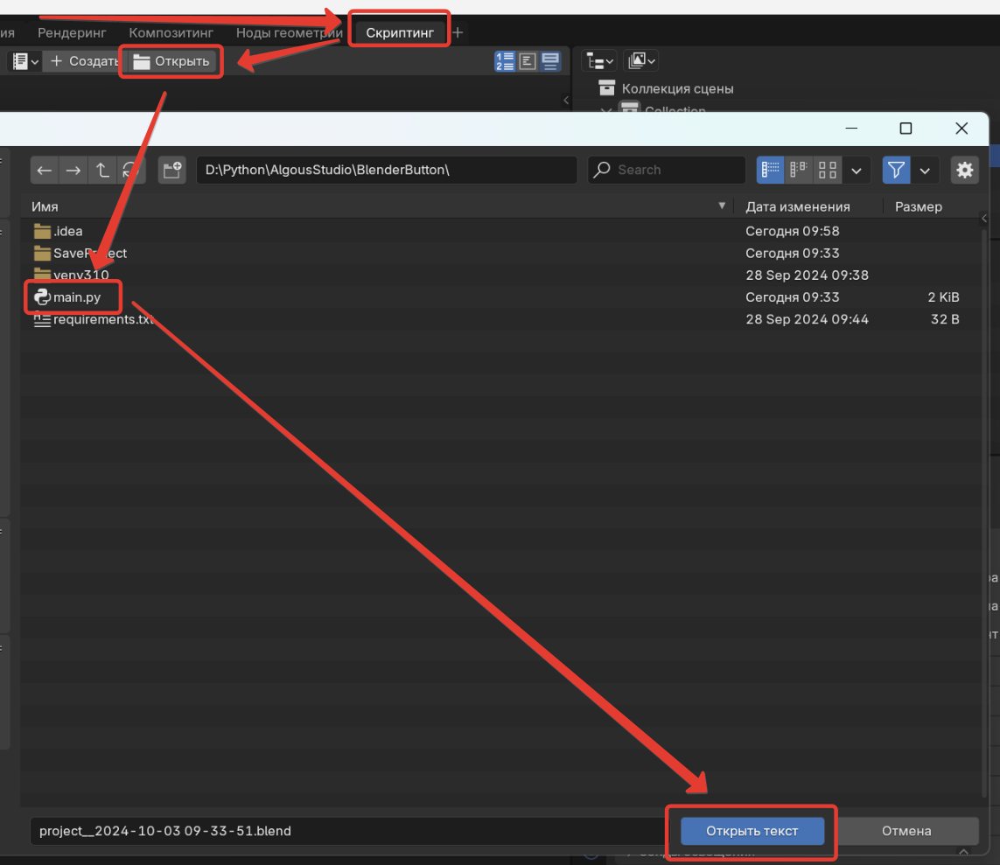
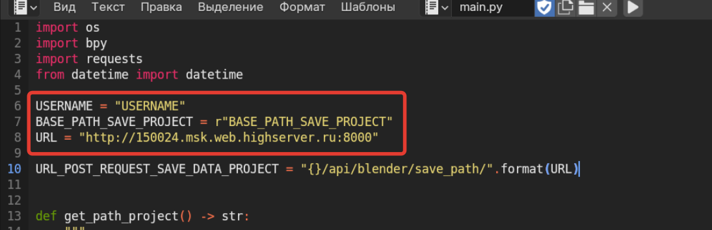
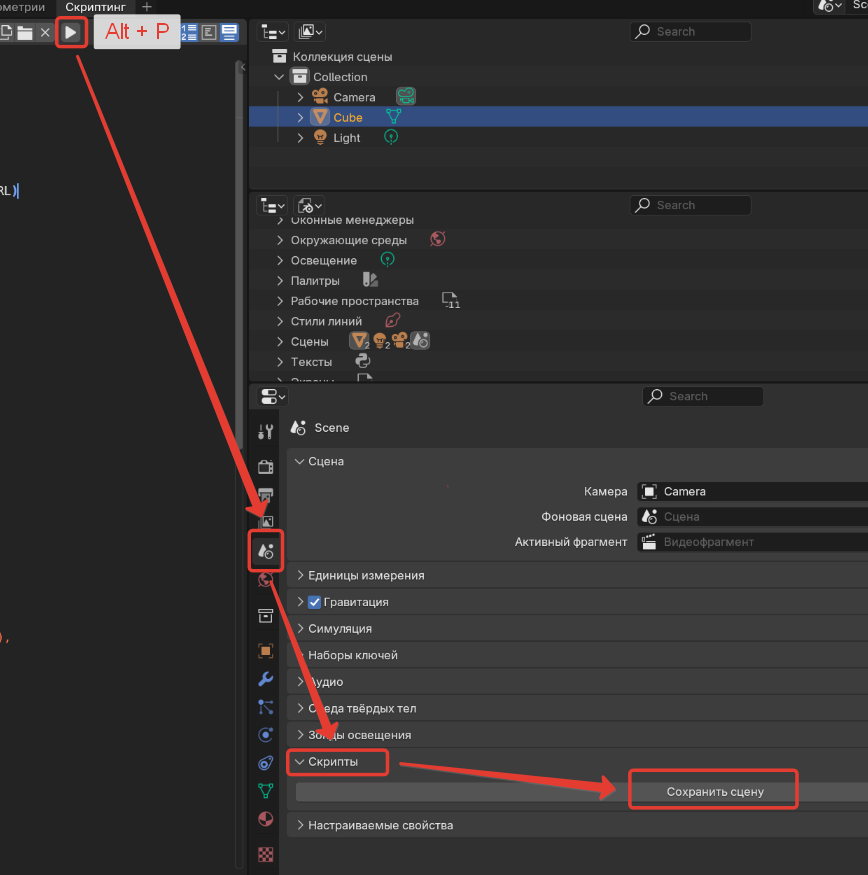

## Описание

Скрипт для Blender для сохранения сцены и отправка пост запроса на сервер для сохранения информации о времени сохранения сцены.

Выполнено в рамках технического задания.

## Установка.

- **Клонируем репозиторий.**
```bash
git clone https://github.com/Omoluzu/astudio_button_blender_save_data.git
```

- **Открываем скрипт в Blender.**  
Скриптинг -> Открыть  
Открывает пусть до склонированого репозитория, и выбираем файл скрипта `main.py`  



- Редактируем параметры скрипта.  
USERNAME - Указываем имя пользователя  
BASE_PATH_SAVE_PROJECT - Указываем путь до сохранения сцены  
URL - Настроен на действующий VPS-сервер, если развернете свой сервер то необходимо будет указать его адрес  



- **Инициализация скрипта в Blender.**  
Нажимаем кнопку "запустить скрипт" или "Alt + P".  
Переходим во вкладку сцена. Там должно появится добавочное поле "Скрипты". и кнопка "Сохранить сцену".



- **Сохраняем сцену.**  
При нажатии на кнопку "Сохранить сцену", текущая cцена будет сохранена по адресу указанном в "BASE_PATH_SAVE_PROJECT" и отправлен POST для сохранения информации о времени сохранения сцены пути и пользователя. 
  
- **Проверяем работу.**  
Переходим на указанный нами сервер в Админ панель "/admin", вводим логин пароль.  
Переходим во вкладку "Path to save blender projects". И кликаем на последнюю сохраненную запись в котором есть вся требуемая информация. 